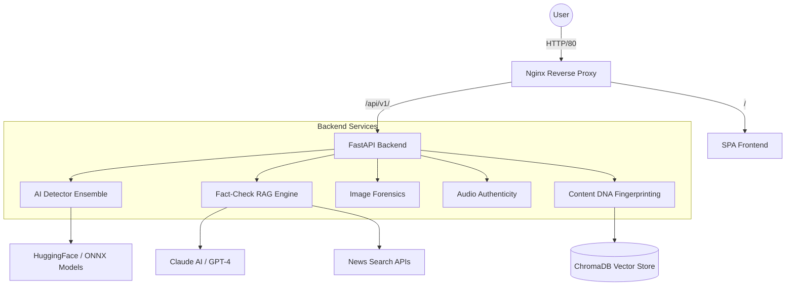

# 🛡️ TruthScan — AI Detection & Fact Verification Platform

[](https://github.com/ravibhatt2406/deepfake)
[](https://fastapi.tiangolo.com/)
[](https://developer.mozilla.org/en-US/docs/Web/JavaScript)
[](https://www.docker.com/)

**TruthScan** is a production-grade ecosystem designed for content integrity, authenticity analysis, and verifiable fact-checking. It combines advanced deep learning ensembles with Retrieval-Augmented Generation (RAG) to provide an end-to-end solution for combating misinformation and synthetic media.

---

## 🏗️ System Architecture

The platform uses a modular, containerized architecture for high scalability and reliability.



---

## 🌟 Core Modules

### 🤖 1. AI Content Detection
An ensemble of state-of-the-art models (EfficientNet, Xception, CLIP) capable of detecting:
- **Synthetic Images/Video**: Perceptual and frequency-level anomaly detection.
- **AI-Generated Text**: Large-scale language model signature detection.
- **Deepfake URLs**: Real-time crawling and analysis of suspicious links.

### 📰 2. RAG-based Fact-Checking
Moving beyond simple pattern matching, our fact-checker uses **Retrieval-Augmented Generation**:
- **Zero Hallucination**: Grounding all verdicts in retrieved snippets from trusted news sources (Reuters, BBC, AP).
- **Explainable AI**: Providing line-by-line evidence, source links, and credibility scores.
- **Cross-Lingual support**: Detection of disinformation across multiple languages.

### 🔬 3. Multi-Layer Image Forensics
Deep-level analysis of image authenticity:
- **ELA (Error Level Analysis)**: Identifying compression inconsistencies.
- **Metadata Scrubbing**: Recovering hidden EXIF/GPS/Software signatures.
- **GAN Fingerprinting**: Specialized detection for StyleGAN and DALL-E signatures.

### 🎧 4. Audio Authenticity (New)
Sophisticated analysis for the "Deepfake Audio" era:
- **Synthetic Voice Detection**: Identifying robotic prosody and phoneme repetition.
- **Voice Cloning Analysis**: Matching spectral signatures against known human profiles.
- **Tamper Detection**: Detecting splicing, editing, and background noise floor mismatches.

---

## 🚀 Deployment & Installation

### Option A: One-Click (Docker Compose)
This is the recommended way to run the full stack (Nginx + Backend + Frontend).

```bash
cd truthscan-platform
docker-compose up --build -d
```
Access the platform at **`http://localhost`**.

### Option B: Local Development

**Backend Setup:**
```bash
cd backend
python -m venv .venv
source .venv/bin/activate  # or .venv\Scripts\activate on Windows
pip install -r requirements.txt
cp .env.example .env       # Add your API keys
$env:PYTHONPATH="."
uvicorn main:app --port 8000 --reload
```

**Frontend Setup:**
Simply serve the `frontend/` folder:
```bash
cd frontend
python -m http.server 80
```

---

## 🛠️ Technology Stack

| Layer | Technologies |
|-------|--------------|
| **Core** | Python 3.10+, FastAPI, Pydantic v2 |
| **AI/ML** | PyTorch, ONNX, HuggingFace, OpenAI CLIP, EfficientNet |
| **Database** | ChromaDB (Vector), Redis (Cache) |
| **Frontend** | Vanilla JS, CSS3, HTML5 (SPA Architecture) |
| **Infrastructure** | Docker, Nginx, GitHub Actions |

---

## 📺 Project Previews

| Dashboard | Result Analysis |
|-----------|-----------------|
|  |  |

---

## 📜 License
Developed as part of the **TruthScan Initiative**. Proprietary — All rights reserved.
